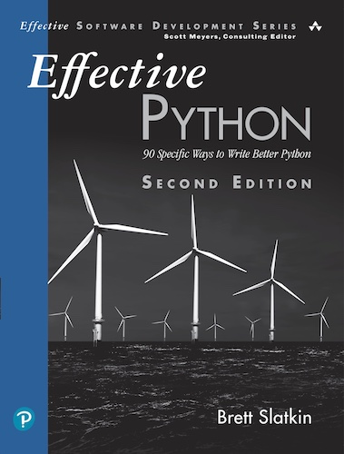

# effectitve_python

This is an unofficial source code repository for _Effective Python: Second Edition_. I am using it for personal training. All the examples are taken from the book and are written using the jupyter notebook and ipython.

